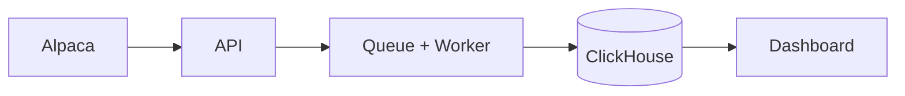

# Streaming Stock Pipeline

A pet project simulating a real-life financial data streaming pipeline using PostgreSQL, Debezium, Kafka, and ClickHouse.

---

## Local Setup

Gets you from a fresh clone to a running API, worker, Postgres, Redis, and a
4-node ClickHouse cluster.

### Architecture



The API never talks to Alpaca on the request path. It enqueues a job and
returns immediately; the worker does the pull and the ClickHouse insert.

### Prerequisites

| Tool | Version | Notes |
|---|---|---|
| Docker + Compose v2 | 24+ | `docker compose version` must work (not `docker-compose`) |
| [uv](https://docs.astral.sh/uv/) | 0.5+ | Python package/venv manager |
| Python | 3.14 | `uv` installs it for you if missing |
| Alpaca paper account | — | Needed for OAuth client ID/secret |

Roughly 4 GB of free RAM: the ClickHouse cluster is 4 servers + 3 keepers.

### 1. Environment files

Two `.env` files, for two different consumers:

- `infra/.env` — read by the Compose services (Postgres init, ClickHouse init, containerised api/worker).
- `backend/.env` — read by `app/config.py` when you run the API or worker **on the host**.

```bash
cp infra/.env.example infra/.env
cp backend/.env.example backend/.env
```

Generate the two secrets and paste them into `backend/.env`:

```bash
# FERNET — encrypts the stored Alpaca access token
python -c "from cryptography.fernet import Fernet; print(Fernet.generate_key().decode())"

# SESSION_SECRET_KEY — signs the OAuth session cookie
python -c "import secrets; print(secrets.token_hex(32))"
```

Then fill in `ALPACA_APP_CLIENT_ID` / `ALPACA_APP_CLIENT_SECRET` from your
Alpaca OAuth app, and pick any values you like for the database users
(`APP_DB_USER`, `CH_ADMIN_USER`, ...) as long as they match between the two
files.

> `CH_LZ_DATABASE` must be set in `infra/.env` — `infra/clickhouse/init.sh`
> interpolates it unquoted, so an empty value produces
> `CREATE DATABASE IF NOT EXISTS ` and the landing zone never gets created.

### 2. Start the infrastructure

Bring up only the datastores, so you can run the API with hot reload on the host:

```bash
cd infra
docker compose up -d postgres redis clickhouse-init
```

`clickhouse-init` pulls in all four ClickHouse servers and three keepers via
`depends_on`, so there's no need to list them.

Check everything is healthy and the ClickHouse bootstrap succeeded:

```bash
docker compose ps
docker compose logs clickhouse-init     # should end with "Done."
```

### 3. Run the migrations

Two independent Alembic histories — two databases, two dialects, two
`alembic_version` tables:

```bash
cd ../backend
uv sync

uv run alembic upgrade head                             # Postgres: users, user_alpaca_tokens
uv run alembic -c clickhouse_alembic.ini upgrade head   # ClickHouse: landing_zone.*
```

Verify both landed:

```bash
docker exec -it tradelens_postgres psql -U "$APP_DB_USER" -d tradelens -c '\dt'

curl -s 'http://localhost:8123/' -u "$CH_ADMIN_USER:$CH_ADMIN_PASSWORD" \
     --data 'SHOW TABLES FROM landing_zone'
```

Expected: `users` + `user_alpaca_tokens` in Postgres,
`alpaca_account_snapshot` + `alpaca_position_snapshot` in ClickHouse.

### 4. Run the API and the worker

Two terminals, both from `backend/`:

```bash
uv run uvicorn app.api.main:app --reload --port 8000
```

```bash
uv run arq app.worker.main.WorkerSettings
```

API docs at <http://localhost:8000/docs>.

### 5. Connect Alpaca and trigger a sync

Complete the OAuth flow once in the browser (start from the frontend, or hit
the auth router directly). That writes an encrypted token row into
`user_alpaca_tokens` and sets an `access_token` cookie.

Copy that cookie from DevTools -> Application -> Cookies, then:

```bash
curl -i -X POST http://localhost:8000/dashboard/sync \
     -b "access_token=<paste-jwt-here>"
```

Expect a JSON body with two `job_id`s — one for `/v2/account`, one for
`/v2/positions`.

### 6. Verify the data actually landed

The worker log is not sufficient proof; check the row counts:

```bash
docker compose -f infra/docker-compose.yml exec redis redis-cli --scan --pattern 'arq:*'

curl -s 'http://localhost:8123/' -u "$CH_ADMIN_USER:$CH_ADMIN_PASSWORD" \
     --data 'SELECT count() FROM landing_zone.alpaca_account_snapshot'
```

A worker log showing a completed job alongside `count() = 0` means the insert
coroutine was never awaited — check for a `RuntimeWarning: coroutine ... was
never awaited` in the worker output.

### 7. Full containerised run

Once the host-side loop works, build and run everything in Compose:

```bash
cd infra
docker compose up -d --build
docker compose logs -f api worker
```

### Teardown

```bash
cd infra
docker compose down            # stop containers, keep data
docker compose down -v         # also delete the Postgres and Redis volumes
```

`down -v` destroys the `postgres_data` and `redis-data` volumes — you'll need
to re-run both migrations and redo the Alpaca OAuth flow afterwards.

### Troubleshooting

<!-- TODO: fill this in with the failures you actually hit, with the real error
     text and the fix. This section is what makes a README credible — a
     stranger can't debug from a template. Candidates so far:
       - pydantic ValidationError on startup (missing key in backend/.env)
       - ClickHouse migration fails: "Database landing_zone doesn't exist"
       - worker job completes instantly, ClickHouse count() stays 0
-->

### Design decisions

<!-- TODO: three bullets, one line each. Why ClickHouse and not Postgres for
     the analytics layer; why a task queue instead of syncing inside the
     request handler; why two separate Alembic histories. Write these in your
     own words — they're the section an interviewer reads.
-->

---

## Prerequisite Knowledge

### 1. Market Structure

A **financial exchange** (NYSE, NASDAQ, Binance) runs a **matching engine** — the core system that pairs buy orders with sell orders and emits a **trade event** when a match occurs.

Key participants:
- **Market makers** — firms that continuously post both buy and sell quotes to provide liquidity. They profit from the spread (Jane Street, Citadel Securities).
- **Takers** — participants who hit existing quotes (retail traders, institutions, HFTs).
- **Broker** — intermediary between a trader and the exchange (Alpaca, Robinhood, Fidelity).

---

### 2. Order Types

An **order** is an instruction to buy or sell an asset.

| Order Type | Behavior |
|-----------|----------|
| **Market** | Execute immediately at the best available price |
| **Limit** | Execute only at a specified price or better |
| **Stop** | Becomes a market order when price hits the trigger |
| **Stop-Limit** | Becomes a limit order when trigger is hit |

**Time-in-force qualifiers** control how long an order stays active:

| TIF | Meaning |
|-----|---------|
| **GTC** (Good Till Cancelled) | Stays open until filled or manually cancelled |
| **Day** | Cancelled at end of the trading day |
| **IOC** (Immediate or Cancel) | Fill what's available now, cancel the rest |
| **FOK** (Fill or Kill) | Fill the entire quantity immediately or cancel entirely |

**Order lifecycle** — each transition is an UPDATE event on the `orders` table, which Debezium captures as a CDC event:

```
NEW → PENDING_NEW → ACCEPTED → PARTIALLY_FILLED → FILLED
                                                 ↘ CANCELLED
                              ↘ REJECTED
                              ↘ EXPIRED
```

---

### 3. The Order Book

The **order book** is a real-time list of all open (unexecuted) limit orders on both sides of the market, sorted by price.

```
                   ORDER BOOK: AAPL
─────────────────────────────────────────
         ASK side (sellers)
  Price     | Quantity | # Orders
  $182.50   |   2,400  |    8      ← Best Ask (lowest ask)
  $182.55   |   5,100  |   15
  $182.60   |   8,900  |   22
─────────────────────────────────────────
         BID side (buyers)
  $182.45   |   3,200  |   11      ← Best Bid (highest bid)
  $182.40   |   6,800  |   19
  $182.30   |   9,400  |   27
─────────────────────────────────────────
  Spread = $182.50 - $182.45 = $0.05
```

| Term | Definition |
|------|-----------|
| **Best Bid** | Highest price a buyer is currently willing to pay |
| **Best Ask** | Lowest price a seller is currently willing to accept |
| **BBO** | Best Bid and Offer together ("top of book") |
| **Spread** | `Ask - Bid`. Narrow spread = liquid market. Wide spread = illiquid. |
| **Mid-price** | `(Bid + Ask) / 2`. Used as a fair value estimate. |
| **Depth** | Total volume available at each price level |
| **Walking the book** | A large market order consuming multiple price levels, causing slippage |

---

### 4. Trade vs Quote

Often confused:

- **Quote** — a bid/ask price posted by a market maker. No transaction yet. The order book is made of quotes.
- **Trade** (also called a **tick**) — an actual executed transaction. Money and shares changed hands.

```
Quote update:  AAPL bid=$182.44, ask=$182.51   (order book changed, no trade)
Trade event:   AAPL traded 100 shares @ $182.50 (actual execution)
```

---

### 5. Market Data Levels

Different data feeds provide different granularity:

| Level | Contains | Pipeline use case |
|-------|---------|------------------|
| **L1** | Best bid/ask (BBO) + last trade price | Price alerts, retail quotes |
| **L2** | Full order book depth aggregated by price level | Analytics, order flow analysis |
| **L3** | Individual orders (who placed what at what price) | Market making, HFT research |

Binance's `@trade` stream is **L1 trade data**. The `@depth` stream is **L2 order book data**. This project primarily uses L1 trades.

---

### 6. OHLCV / Candlesticks

Raw tick data is too granular for most analysis. Ticks are aggregated into **bars** (also called **candlesticks**):

```
1-minute bar for AAPL from 10:00:00 to 10:00:59:

  Open   = price of the FIRST trade in that window
  High   = HIGHEST price traded in that window
  Low    = LOWEST price traded in that window
  Close  = price of the LAST trade in that window
  Volume = TOTAL shares traded in that window
```

**VWAP** (Volume-Weighted Average Price):

```
VWAP = sum(price × volume) / sum(volume)
```

The benchmark institutional traders use to evaluate execution quality. If you bought below VWAP, you beat the market average for that period.

In this project, OHLCV bars are computed in real-time inside ClickHouse using **Materialized Views** on the raw `trades` table.

---

### 7. Event Time vs Processing Time

This is the most important concept for streaming pipeline correctness.

```
Timeline of a single trade:

  10:00:00.000  ← Exchange timestamp  (when trade actually happened)  [event time]
       ↓
  10:00:00.023  ← Market data vendor received it
       ↓
  10:00:00.089  ← Ingestion service received it
       ↓
  10:00:00.102  ← Written to PostgreSQL
       ↓
  10:00:00.118  ← Debezium captured it from WAL
       ↓
  10:00:00.134  ← Landed in Kafka
       ↓
  10:00:00.201  ← ClickHouse stored it                               [processing time]
```

| Time Type | Meaning | Field in this project |
|-----------|---------|----------------------|
| **Event time** | When it happened at the exchange | `trade_ts` |
| **Processing time** | When your system processed it | `ingested_at` |

**Why it matters**: If you build OHLCV windows on processing time instead of event time, a slow network or Kafka lag will produce wrong candlesticks. Always window on `trade_ts`. This also means late-arriving data (a tick with an old `trade_ts` that arrives late) must be handled explicitly — this is the **watermark** problem.

---

### 8. CDC Event Types (Debezium)

**Change Data Capture (CDC)** captures every INSERT, UPDATE, and DELETE on a database table and streams them as events. Debezium reads PostgreSQL's Write-Ahead Log (WAL) to do this.

| Debezium `op` field | Meaning | Example |
|--------------------|---------|---------|
| `"c"` (create) | A row was inserted | New trade, new order placed |
| `"u"` (update) | A row was updated | Order status changed |
| `"d"` (delete) | A row was deleted | Price alert removed by user |
| `"r"` (read) | Snapshot on connector startup | Initial load of existing rows |

Each event includes a **before** and **after** state, so you always know what changed.

The four source tables in this project are designed to exercise all CDC event types:

| Table | Source | CDC events produced |
|-------|--------|---------------------|
| `trades` | Binance/Finnhub WebSocket | INSERT only (immutable facts) |
| `orders` | Alpaca paper trading | INSERT + UPDATE (status lifecycle) |
| `symbols` | Static + Alpaca metadata | INSERT + UPDATE + DELETE (slowly changing) |
| `price_alerts` | This project's API | INSERT + UPDATE + DELETE (user-managed) |

---

### 9. Corporate Actions

Events that change the structure or price of a stock. Critical because they **corrupt historical data** if not handled.

| Action | Effect |
|--------|--------|
| **Stock split** (e.g. 4:1) | Price drops to 1/4, share count multiplies. All historical prices must be adjusted backward. |
| **Reverse split** | Price multiplies, share count decreases. |
| **Dividend** | Price drops by the dividend amount on the ex-date. |
| **Merger / Acquisition** | Symbol may change or cease to exist. |

**Adjusted price** = historical price retroactively corrected for all subsequent corporate actions, so prices are comparable across time. Always store which version you have.

---

### 10. Settlement vs Execution

- **Execution** — the trade matches on the exchange and is immediately confirmed.
- **Settlement** — the actual transfer of money and shares completes later:
  - US stocks: **T+1** (trade date + 1 business day, as of May 2024)
  - Crypto: **T+0** (near-instant, on-chain)

Relevant to this project only if modeling a brokerage's cash and position accounting. For market data analytics (price/volume), settlement can be ignored.

---

### 11. Key Pipeline Design Decisions Driven by Domain

| Domain fact | Design decision |
|------------|----------------|
| Trades are immutable | `trades` table is append-only → `MergeTree` in ClickHouse |
| Orders have a lifecycle | `orders` needs UPDATE support → `ReplacingMergeTree(updated_at)` |
| Symbols can be delisted | Hard deletes in source → soft delete `_deleted` flag in ClickHouse |
| Event time ≠ processing time | `ORDER BY (symbol, trade_ts)` in ClickHouse, not `ingested_at` |
| Crypto trades 24/7 | Use Binance as primary source (no market hours downtime) |
| Corporate actions change history | Store `is_adjusted` flag, handle in serving layer |
