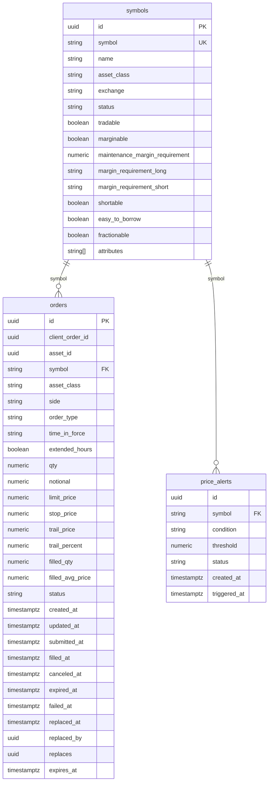

# Data Models — Operational Database (PostgreSQL)

## Entity Relationship Diagram

## Relationships

| From | To | Cardinality | Description |
|---|---|---|---|
| `symbols` | `orders` | one-to-many | Each order references one tradeable symbol |
| `symbols` | `price_alerts` | one-to-many | Each alert is tied to one symbol's price feed |

## Notes

- `orders` and `price_alerts` are **not directly related** — they join analytically via `symbol` and timestamps in ClickHouse
- `symbols.symbol` is the FK target (not `id`) because it is the natural join key used across the pipeline
- `orders.qty` and `orders.notional` are mutually exclusive — dollar-based orders set `notional`, share-based orders set `qty`
- `orders.replaced_by` and `orders.replaces` are self-referencing UUIDs for order amendment tracking
